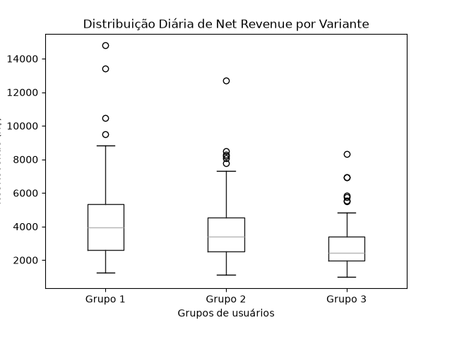

# Relatório Executivo de Teste A/B de Cashback - Parceiro A

**Para:** Liderança de Growth, Equipe de Produto e Marketing
**De:** Analista de Growth Sênior AI-Native (Méliuz)
**Data:** 23 de Outubro de 2023
**Assunto:** Análise Consolidada do Teste A/B de Cashback para o Parceiro A

---

## 1. Resumo Executivo

O teste A/B realizado com o Parceiro A teve como objetivo avaliar o impacto de diferentes ofertas de cashback na performance das campanhas, buscando otimizar o Net Revenue (lucro líquido do Méliuz). Foram testados três grupos de usuários com variações nas porcentagens de cashback.

Embora o **Grupo 3** tenha gerado o maior volume de vendas totais e atraído o maior número de compradores, ele também incorreu no maior custo de cashback, resultando no **menor Net Revenue** para o Méliuz. Por outro lado, o **Grupo 1**, com o menor custo de cashback, se destacou ao entregar o **maior Net Revenue** e o melhor ROI de Cashback.

A análise estatística rigorosa, utilizando o Teste T de Student sobre dados diários, indicou que **não há diferença estatisticamente significante** entre os grupos em termos de lucro acumulado. Esta falta de significância é crucial para a tomada de decisão.

---

## 2. Análise Crítica das Variantes

Aprofundando na performance de cada grupo, observamos padrões distintos que ressaltam a importância da métrica de Net Revenue:

*   **Grupo 1:** Este grupo, apesar de ter o menor número de compradores e volume de vendas, apresentou a maior eficiência. Com um cashback de R$ 233.424, gerou um Net Revenue de **R$ 404.711** e o maior ROI de Cashback (24.01). Isso demonstra uma alocação mais eficiente do capital de cashback.
*   **Grupo 2:** Um grupo intermediário, com volumes de compradores e vendas maiores que o Grupo 1, mas com um custo de cashback de R$ 370.659, resultando em um Net Revenue de R$ 357.519. Seu ROI de Cashback foi de 17.33.
*   **Grupo 3:** Este grupo impulsionou o maior volume de vendas (R$ 6.785.860) e atraiu a maior base de compradores (11.410). No entanto, o custo de cashback foi o mais elevado (R$ 503.600), resultando no **menor Net Revenue (R$ 264.287)** e o menor ROI de Cashback (13.47).

### O Conceito de "Falso Vencedor"

Os resultados do Grupo 3 exemplificam perfeitamente o conceito de "falso vencedor". Se a análise se limitasse apenas a métricas de vaidade como "vendas totais" ou "número de compradores", o Grupo 3 poderia ser erroneamente considerado o mais bem-sucedido. Contudo, ao incorporar o custo do cashback e focar no **lucro líquido (Net Revenue)**, fica evidente que o maior volume não se traduziu em maior rentabilidade para o Méliuz. O custo adicional do cashback no Grupo 3 canibalizou significativamente a margem de lucro, transformando um aparente "sucesso" em uma operação menos rentável em comparação com o Grupo 1.

---

## 3. Validação Estatística

O p-valor calculado de **0.1315** é a métrica chave para a nossa decisão. Em termos técnicos, o p-valor representa a probabilidade de observarmos uma diferença de lucro tão grande ou maior entre os grupos como a que vimos, caso, na realidade, não houvesse diferença alguma entre as ofertas de cashback (hipótese nula).

Considerando um nível de significância padrão de 0.05 (ou 5%), um p-valor de 0.1315 (13.15%) é **maior que 0.05**. Isso significa que **não temos evidências estatísticas suficientes para rejeitar a hipótese nula**. Em outras palavras, não podemos afirmar com 95% de confiança que a superioridade observada no Net Revenue do Grupo 1 é realmente causada pela oferta de cashback e não apenas por flutuações aleatórias.

### Por que analisar apenas a soma acumulada pode ser perigoso:

A simples observação de que o Grupo 1 teve o "maior lucro acumulado" é um dado importante, mas isoladamente é perigoso para a operação do Méliuz. Sem a validação estatística, essa diferença pode ser fruto do acaso e não de um impacto real da variante.

Se baseássemos decisões estratégicas apenas na soma acumulada sem um teste de significância, correríamos o risco de:
*   **Implementar uma estratégia ineficaz:** Poderíamos alocar recursos em uma variante que não oferece um benefício real, desperdiçando cashback.
*   **Ocultar ineficiências:** Uma variante com maior lucro total por acaso pode nos impedir de buscar e otimizar outras ofertas que poderiam gerar ganhos comprovados.
*   **Decisões baseadas em ruído:** Ignorar a aleatoriedade e o ruído nos dados pode levar a conclusões falhas e a uma otimização subótima das ofertas de cashback.

É por isso que a abordagem AI-Native no Méliuz prioriza a robustez estatística, garantindo que nossas decisões sejam baseadas em insights confiáveis e não em percepções superficiais.

---

## 4. Decisão Acionável Conclusiva

Com base na análise consolidada dos dados e no veredito do mecanismo estatístico, a recomendação rigorosa é:

**Empate Técnico - Manter Grupo 1 por menor risco.**

**Justificativa:**
Dado que não há uma diferença estatisticamente significante que comprove que qualquer uma das variantes de maior cashback (Grupo 2 ou 3) gere um Net Revenue superior ao Grupo 1, e considerando que o **Grupo 1 entregou o maior Net Revenue com o menor custo de cashback**, esta é a abordagem mais prudente. Manter a estratégia do Grupo 1 nos permite:

1.  **Maximizar a Rentabilidade no Cenário Atual:** Sem evidências de que um cashback maior traria retornos estatisticamente superiores, o Grupo 1 representa a variante que maximiza o lucro líquido do Méliuz.
2.  **Minimizar o Risco Operacional e Financeiro:** Evita o desembolso desnecessário de cashback que não demonstrou um retorno proporcional comprovado, protegendo as margens de lucro.
3.  **Manter a Eficiência:** Foca na eficiência do capital, alinhando-se com uma estratégia de growth sustentável e lucrativa.

Recomendamos manter a política de cashback equivalente à do Grupo 1 para o Parceiro A, enquanto continuamos a monitorar a performance e a explorar futuras otimizações.

### Evidência Visual da Distribuição

